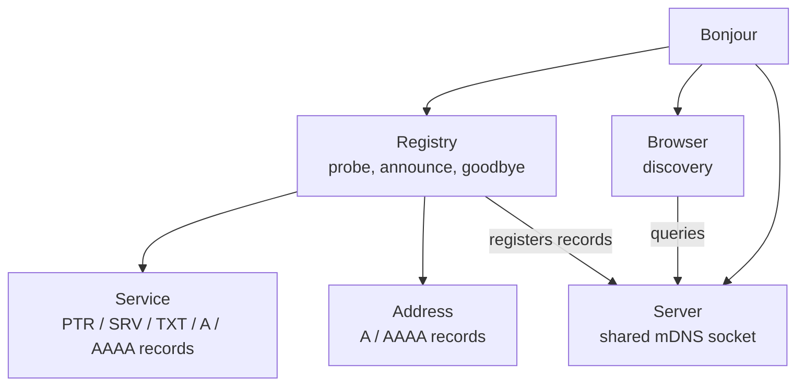
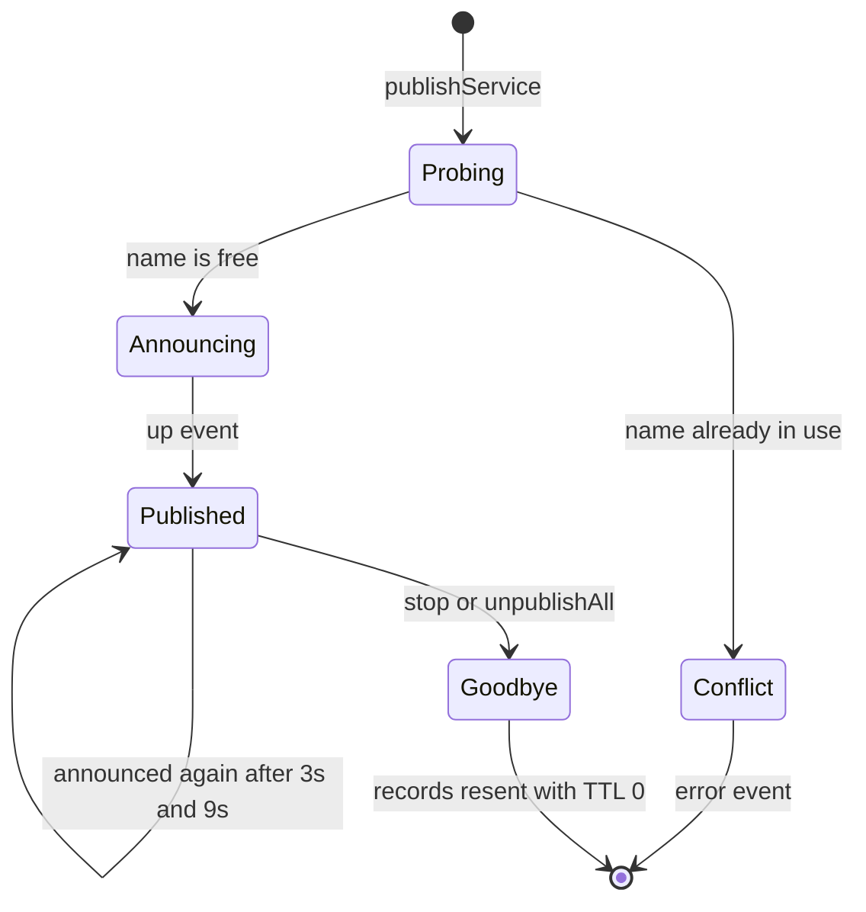

# bonjour

A Bonjour/Zeroconf protocol implementation in pure JavaScript. Publish services and hostnames on the local network, or discover existing services using multicast DNS.

## Installation

```
npm install @eventengineering/bonjour
```

### Requirements

- Node.js 22 or later.
- This package is **ESM only**. Use `import`; there is no CommonJS build.

## Usage

```js
import Bonjour from '@eventengineering/bonjour';

const bonjour = new Bonjour();

// advertise an HTTP server on port 3000
bonjour.publishService({ name: 'my-web', type: 'http', port: 3000 });

// browse for all http services
bonjour.find({ type: 'http' }, (service) => {
	console.log('Found an HTTP server:', service.fqdn);
});
```

Note that service names and types are limited to 15 characters — see [Publishing](#publishing) below.

## Architecture

`Bonjour` is a thin facade over four moving parts. One mDNS socket is shared by everything created from the same instance.



## Exports

```js
import Bonjour, { Service, Address, Browser, Registry, Server } from '@eventengineering/bonjour';
```

- `Bonjour` (default) — the high level interface, and all most callers need.
- `Service`, `Address` — the models describing what gets published. Can be built up front and handed to `publishService()` / `publishAddress()`.
- `Browser`, `Registry`, `Server` — the lower level building blocks. See [Lower level API](#lower-level-api).

## API

### Initializing

```js
import Bonjour from '@eventengineering/bonjour';
const bonjour = new Bonjour([options]);
```

The `options` are optional and will be used when initializing the underlying multicast-dns server. For details see [the multicast-dns documentation](https://github.com/mafintosh/multicast-dns#mdns--multicastdnsoptions).

### Publishing

#### `const service = bonjour.publishService(options)`

Publishes a new service and returns the [`Service`](#service) instance describing it. Publication is asynchronous — listen for the [`up`](#event-up-1) event to know when the service has been announced.

Options are:

- `name` (string) — required. Maximum 15 characters, matching `([0-9]-?)?[a-z](-?[a-z0-9])*` (case insensitive). An invalid or missing name throws.
- `type` (string) — required. Same restrictions as `name`.
- `port` (number) — required. Between 0 and 65535.
- `host` (string, optional) — defaults to the local hostname. The domain is appended if missing, so `foo` becomes `foo.local`.
- `protocol` (string, optional) — `udp` or `tcp` (default).
- `domain` (string, optional) — defaults to `local`.
- `txt` (object, optional) — a key/value object to broadcast as the TXT record. See [TXT records](#txt-records).
- `txtSettings` (object, optional) — passed to the TXT encoder. Set to `{ binary: true }` to keep TXT values as buffers.
- `probe` (boolean, optional) — defaults to `true`. When `true` the network is probed for a conflicting service name before announcing, and an [`error`](#event-error) is emitted if the name is already taken. Set to `false` to announce immediately.

A pre-built `Service` instance may be passed instead of an options object:

```js
import Bonjour, { Service } from '@eventengineering/bonjour';

const bonjour = new Bonjour();
const service = bonjour.publishService(new Service({ name: 'my-web', type: 'http', port: 3000 }));
```

This is the lifecycle a published service moves through, all of it driven by the registry:



Probing is skipped when `probe` is `false`, and always skipped for addresses.

IANA maintains a [list of official service types and port numbers](http://www.iana.org/assignments/service-names-port-numbers/service-names-port-numbers.xhtml).

#### `const address = bonjour.publishAddress(options)`

Publishes a hostname on the local network — the A/AAAA records of a service, without the service itself. Returns the [`Address`](#address) instance describing it.

Options are:

- `name` (string) — required. The hostname to advertise, between 2 and 255 characters. It may contain several `.` separated parts, each between 2 and 63 characters and matching `[a-z]([-a-z0-9]{0,61}[a-z0-9])?` (case insensitive). An invalid or missing name throws.
- `domain` (string, optional) — defaults to `local`.
- `addresses` (array of strings, optional) — the IP addresses to advertise. Each is published as an A or AAAA record according to whether it is IPv4 or IPv6. When omitted or empty, the host's own external network interfaces are used instead.

```js
bonjour.publishAddress({ name: 'my-box' });                                 // this host's own addresses
bonjour.publishAddress({ name: 'my-nas', addresses: [ '192.168.1.10' ] });  // an address of your choosing
```

Addresses are announced immediately — unlike services they are not probed for conflicts.

#### `bonjour.unpublishAll([callback])`

Unpublish all services and addresses, sending a goodbye message for each so the rest of the network knows they are going away. Returns a promise, and the optional `callback` is called once they have been unpublished.

#### `bonjour.destroy()`

Destroy the mdns instance. Closes the udp socket. This does not send goodbye messages, so call `unpublishAll()` first for a clean shutdown:

```js
await bonjour.unpublishAll();
bonjour.destroy();
```

### Browser

#### `const browser = bonjour.find(options[, onup[, ondown]])`

Listen for services advertised on the network. The optional `onup` and `ondown` callbacks are added as event listeners for the [`up`](#event-up) and [`down`](#event-down) events.

Options (all optional):

- `type` (string) — the service type to look for. If omitted, a wildcard search is performed and every service type on the network is discovered.
- `protocol` (string) — defaults to `tcp`.
- `domain` (string) — defaults to `local`.
- `txt` (object) — settings for the TXT record decoder. Set to `{ binary: true }` if you want to keep the TXT values as buffers.
- `autostart` (boolean) — defaults to `true`. Set to `false` to create the browser without querying, then call [`browser.start()`](#browserstart) yourself.

#### `const browser = bonjour.findOne(options[, callback])`

Listen for and call the `callback` with the first instance of a service matching the `options`. If no `callback` is given, it's expected that you listen for the `up` event. The returned `browser` will automatically stop itself after the first matching service.

Options are the same as given in the `bonjour.find` function.

#### `Event: up`

Emitted every time a new service is found that matches the browser. The listener is called with the [`Service`](#service) that came up. Discovered services are frozen.

#### `Event: down`

Emitted every time an existing service emits a goodbye message. The listener is called with the [`Service`](#service) that went away.

#### `browser.services`

An array of [`Service`](#service) instances known by the browser to be online.

#### `browser.servicesExport`

The same list as `browser.services`, with each service converted to a plain object via [`service.toObject()`](#servicetoobject--servicetojson).

#### `browser.start()`

Start looking for matching services.

#### `browser.stop()`

Stop looking for matching services.

#### `browser.update()`

Broadcast the query again.

### Service

The model returned by `bonjour.publishService()` and emitted by a browser's `up` / `down` events. It can also be constructed directly — `new Service(options)` takes the same options as [`bonjour.publishService()`](#const-service--bonjourpublishserviceoptions) and validates them immediately.

#### `Event: up`

Emitted when the service is up, i.e. it has been announced on the network.

#### `Event: error`

Emitted if an error occurs while publishing the service, including when probing finds the service name already in use.

#### `Event: anouncing`

Emitted with the DNS records each time the service is announced.

#### `service.start()`

Publish the service. Only available on a service that has been handed to `bonjour.publishService()` — it is the registry that provides it.

#### `service.stop([callback])`

Unpublish the service, sending a goodbye message. Returns a promise, and the optional `callback` is called once the service has been unpublished. As with `start()`, only available on a published service.

#### `service.name`

The name of the service, e.g. `apple-tv`.

#### `service.type`

The type of the service, e.g. `http`.

#### `service.protocol`

The protocol used by the service, e.g. `tcp`.

#### `service.domain`

The domain the service is published in, e.g. `local`.

#### `service.host`

The hostname where the service resides, e.g. `my-box.local`. `service.target` is an alias of this property.

#### `service.port`

The port on which the service listens, e.g. `5000`.

#### `service.dn`

The domain name of the service type. E.g. given the type `http`, the protocol `tcp` and the domain `local`, `service.dn` will be `_http._tcp.local`.

#### `service.fqdn`

The fully qualified domain name of the service. E.g. if given the name `foo-bar`, the type `http` and the protocol `tcp`, the `service.fqdn` property will be `foo-bar._http._tcp.local`.

#### `service.txt`

The service's TXT record as a flat key/value object, however the service was built. Changing it in place — `service.txt.path = '/v2'` — re-encodes the record and re-announces it, as does assigning a new object. See [TXT records](#txt-records).

#### `service.txtObj`

An alias of [`service.txt`](#servicetxt), kept for compatibility.

#### `service.rawTxt`

The same record in its encoded form: an array of buffers, one per `key=value` pair. This is what goes on the wire, and on a discovered service it is exactly what arrived — including any pair that could not be decoded.

#### `service.addresses`

An array of IP addresses that the service's host resolves to.

#### `service.referer`

For a discovered service, the remote address info of the packet it was found in — `address`, `family`, `port` and `size`.

#### `service.published`

A boolean indicating if the service is currently published.

#### `service.toObject()` / `service.toJSON()`

A plain object representation of the service, suitable for serialisation.

#### `Service.fromFqdn(fqdn[, otherParts])`

Static. Builds a `Service` by parsing a fully qualified domain name, e.g. `foo-bar._http._tcp.local`. Validation is skipped, so this accepts names the constructor would reject.

### Address

The model returned by `bonjour.publishAddress()`. It can also be constructed directly with `new Address(options)`, taking the same options as [`bonjour.publishAddress()`](#const-address--bonjourpublishaddressoptions).

#### `Event: up`

Emitted when the address has been announced on the network.

#### `Event: anouncing`

Emitted with the DNS records each time the address is announced.

#### `address.start()` / `address.stop([callback])`

As per [`service.start()`](#servicestart) and [`service.stop([callback])`](#servicestopcallback).

#### `address.name`

The advertised hostname, including the domain, e.g. `my-box.local`.

#### `address.domain`

The domain the hostname is published in, e.g. `local`.

#### `address.addresses`

The IP addresses advertised for this hostname, as an array. When empty, the host's own external network interfaces are used instead. Entries that are not valid IP addresses are skipped with a warning.

Assigning to it replaces the list and re-announces the address: records that have gone away are sent as goodbyes, and the new set is announced afresh. Several assignments in a row are coalesced into a single announcement.

```js
const address = bonjour.publishAddress({ name: 'my-nas', addresses: [ '192.168.1.10' ]});

address.addresses = [ '192.168.1.11' ]; // goodbye .10, announce .11
```

#### `address.published`

A boolean indicating if the address is currently published.

#### `address.toObject()` / `address.toJSON()`

A plain object representation of the address, suitable for serialisation.

## TXT records

A service has one TXT record, holding a flat set of key/value pairs (RFC-6763 section 6). Pass it as a plain object:

```js
bonjour.publishService({ name: 'my-web', type: 'http', port: 3000, txt: { path: '/' } });
```

`service.txt` reads back the same way, whether you built the service or found it:

```js
bonjour.find({ type: 'http' }, (service) => {
	console.log(service.txt); // { path: '/', version: '2' }
});
```

It can be changed in place, which re-encodes the record and announces it again:

```js
service.txt.path = '/v2';
delete service.txt.version;
```

A key with no value is a valueless attribute — written without an `=`, and read back as `true`:

```js
bonjour.publishService({ name: 'my-web', type: 'http', port: 3000, txt: { secure: true } }); // "secure"
```

Values are decoded to strings by default. Pass `{ binary: true }` to keep them as buffers — as `txtSettings` when publishing, or as `txt` when browsing:

```js
bonjour.find({ type: 'qlab', protocol: 'udp', txt: { binary: true } }, (service) => {
	console.log(service.txt.version); // <Buffer ...>
});
```

[`service.rawTxt`](#servicerawtxt) holds the encoded form, one buffer per pair. A pair must encode to 255 bytes or fewer and encoding throws if one does not, that being the longest character-string DNS can carry. Pairs that cannot be used — a key with no name, or a repeat of one already seen — are skipped while decoding rather than costing you the rest of the record, and are left untouched in `rawTxt`.

## Lower level API

`Bonjour` is a thin wrapper around a shared mDNS socket, a registry and any number of browsers, as shown in [Architecture](#architecture). Those parts are exported should you need them directly:

```js
import { Server, Registry, Browser } from '@eventengineering/bonjour';

const server = new Server(options);          // wraps multicast-dns, answers queries
const registry = new Registry(server);       // owns probing, announcing and goodbyes
const browser = new Browser(server.mdns, { type: 'http' });

registry.publishService({ name: 'my-web', type: 'http', port: 3000 });
```

- `server.mdns` — the underlying multicast-dns instance.
- `server.register(records)` / `server.unregister(records)` — manage the DNS records the server answers queries with.
- `registry.publish(thing[, probe])` — publish a `Service` or `Address` instance directly.
- `registry.publishService(options)` / `registry.publishAddress(options)` / `registry.unpublishAll([callback])` — as per the `Bonjour` methods of the same name.

## Migrating from 4.x

- **ESM only, Node 22+.** `require()` is no longer supported.
- **`bonjour.publish()` is now `bonjour.publishService()`.** The options are otherwise unchanged.
- **`subtypes` has been removed** from both publishing and browsing, along with `service.subtypes`.
- **`service.txt` is a flat key/value object**, as it was in 4.x, and now reads back the same whether the service was built or discovered. It may also be changed in place. `service.txtObj` is an alias of it, and `service.rawTxt` holds the encoded pairs.
- **TXT records on the wire are fixed.** 4.x length-prefixed each pair itself and then handed the result to dns-packet, which prefixed it again — so the records it published could not be read by other implementations. That framing is now left to dns-packet alone.
- **TXT decoder settings moved.** When publishing, pass `txtSettings` instead of `txt` for encoder options; `txt` is now the record itself. Browsing still takes `txt`.
- **`Service` is now a validating model.** Bad names, types and ports throw from the constructor rather than being published as-is — note the 15 character limit, which rules out names like `Apple TV` that 4.x accepted.
- **New:** [`bonjour.publishAddress()`](#const-address--bonjourpublishaddressoptions) for advertising a hostname on its own, the [`probe`](#publishing) option, `service.txtObj`, `service.rawTxt`, `browser.servicesExport`, and the `Service`, `Address`, `Browser`, `Registry` and `Server` exports.

## License

MIT
